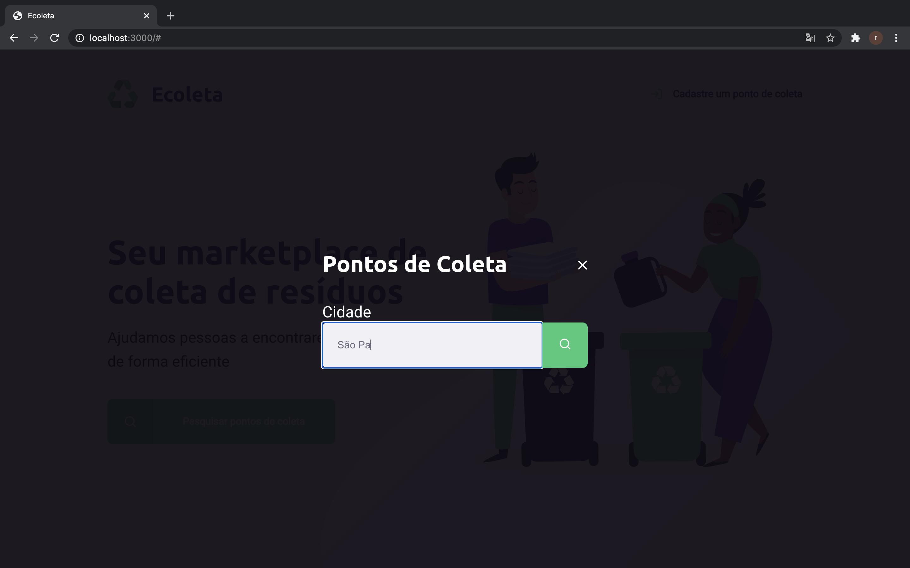
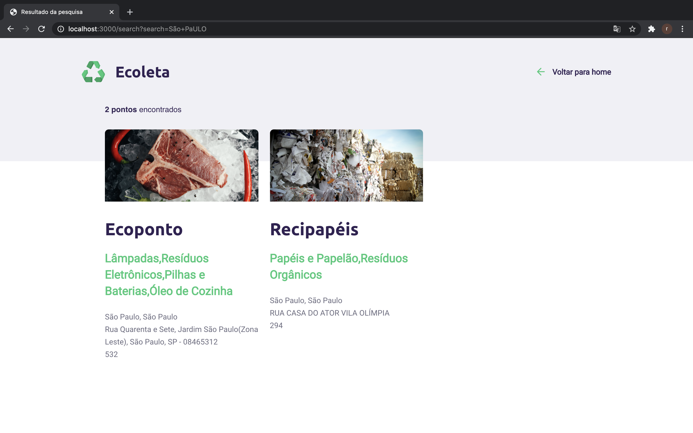

<p align="center">
  
</p>

<h3 align="center">
  Find the closest recycling point to you! 🌿
</h3>

## 💻 Overview
The main goal of Ecoleta is to help people to find companies and entities that colect organic and inorganic material. 

Project was developed during the Next Level Week #1 offered by [Rocketseat](https://rocketseat.com.br/). In this week, we learn more about web development in a practical way.

## 📸 Screenshots

- Main Page
    
    
- Creating a Point
    </br>
    
- Searching for a Point
    
    
- Results
    

## 📥 Getting Started
<p>
  Before you start the project, you need to install Git and Node.js.
</p>

```bash 
#Clone the repository
$ git clone https://github.com/rKayoo/ecoleta

# Acess the folder's project
$ cd ecoleta

# Install the dependencies
$ npm install
```

## 🛠 Technologies
The project used the following technologies: 
- [NodeJS](https://nodejs.org/)
- [Javascript](https://www.javascript.com/)
- [SQLite3](https://www.sqlite.org)

## 📝 LICENSE
This project is licensed under the MIT License - see the [LICENSE.md](https://github.com/rKayoo/ecoleta/blob/master/LICENSE.md) file for details
